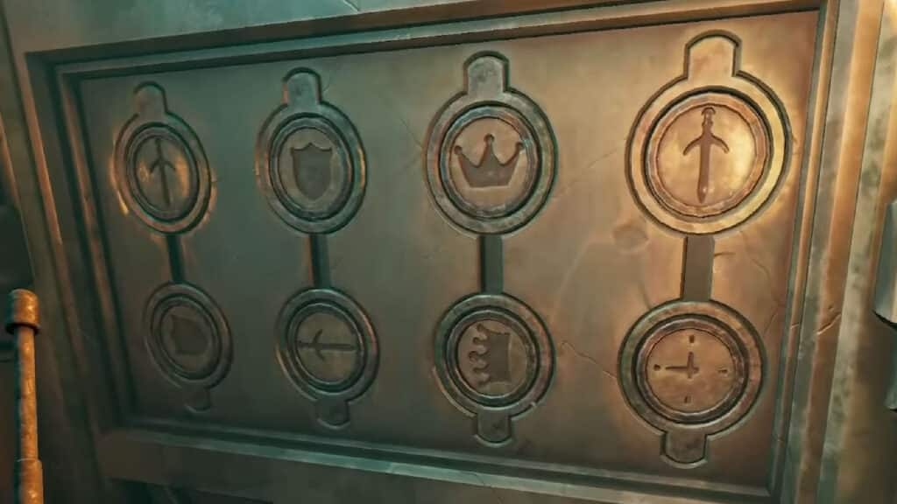
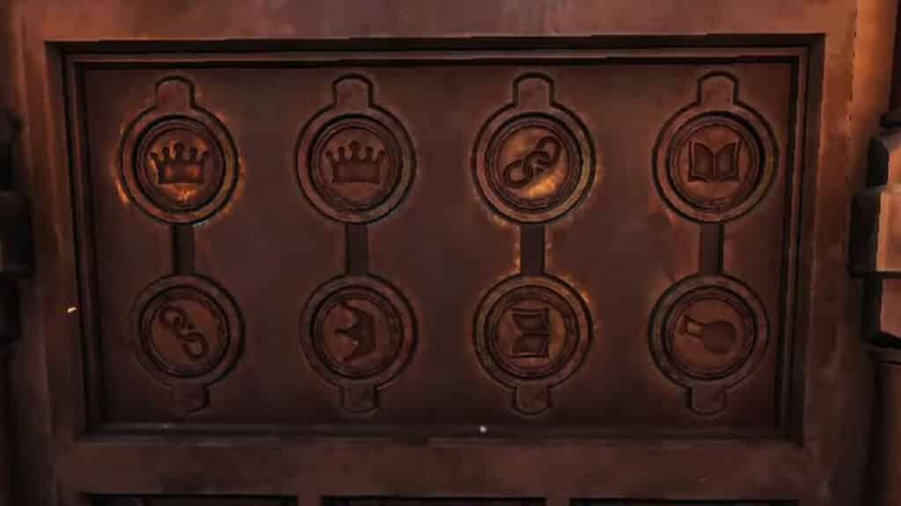
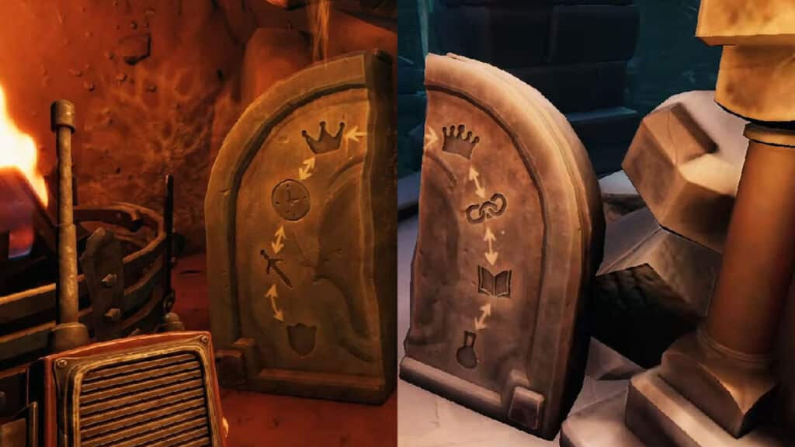

# WWHF Obol Exchange solver

So my friend akurse and I were playing We Were Here Forever game, and we stuck into this puzzle. We couldn't think of the solution by ourselves, so I wrote this code.

## Puzzle idea
Both players see a panel with 8 circular stone emblems. Four of them can be taken to the inventory. Players task is to exchange their emblems so that everyone gets the required ones.

Here is my solution:



And here is his solution:



We can exchange our emblems with each other, but there are some rules of what emblems can be exchanged:



So basically, here is a table of the rules:

| Item         | Possible exchange 1 | Possible exchange 2 |
|--------------|---------------------|---------------------|
| Shield       | Sword               | -                   |
| Sword        | Shield              | Clock               |
| Clock        | Sword               | Jester's hat        |
| Jester's hat | Clock               | King's crown        |
| King's crown | Jester's hat        | Chain               |
| Chain        | King's crown        | Book                |
| Book         | Chain               | Flask               |
| Flask        | -                   | Book                |

We could Google the solution, but eventually we got stuck with our own item sets, so I made this program which calculated our exchange moves.

## Idea

Each item is assigned with a number and a mask (`1 << number`). Desired result is a bitwise OR of the items that I need to have. Zero means this item has to be at akurse's.

```go
var (
	SHIELD = mi(0, "shield")
	SWORD  = mi(1, "sword")
	CLOCK  = mi(2, "clock")
	JESTER = mi(3, "jester")
	KING   = mi(4, "king")
	CHAIN  = mi(5, "chain")
	BOOK   = mi(6, "book")
	JAR    = mi(7, "jar")
)
```

At the moment I had king's crown, book, jester's hat, and clock, which results in state of `KING.Mask()+BOOK.Mask()+JESTER.Mask()+CLOCK.Mask()`. Our desired state is `SHIELD.Mask()+SWORD.Mask()+CLOCK.Mask()+KING.Mask()`.

So basically I made a backtracking search. In each iteration, I tried to exchange each pair of items that is possible to exchange. If the program happens to get to desired state, it saves the result.

So the shortest way of getting to our desired state the program could find was the following:

```
1. Wani4ka gives clock, akurse gives sword
2. Wani4ka gives sword, akurse gives shield
3. Wani4ka gives jester, akurse gives clock
4. Wani4ka gives shield, akurse gives sword
5. Wani4ka gives king, akurse gives jester
6. Wani4ka gives sword, akurse gives shield
7. Wani4ka gives clock, akurse gives sword
8. Wani4ka gives jester, akurse gives clock
9. Wani4ka gives book, akurse gives chain
10. Wani4ka gives clock, akurse gives jester
11. Wani4ka gives sword, akurse gives clock
12. Wani4ka gives shield, akurse gives sword
13. Wani4ka gives chain, akurse gives king
14. Wani4ka gives sword, akurse gives shield
15. Wani4ka gives clock, akurse gives sword
16. Wani4ka gives jester, akurse gives clock
```